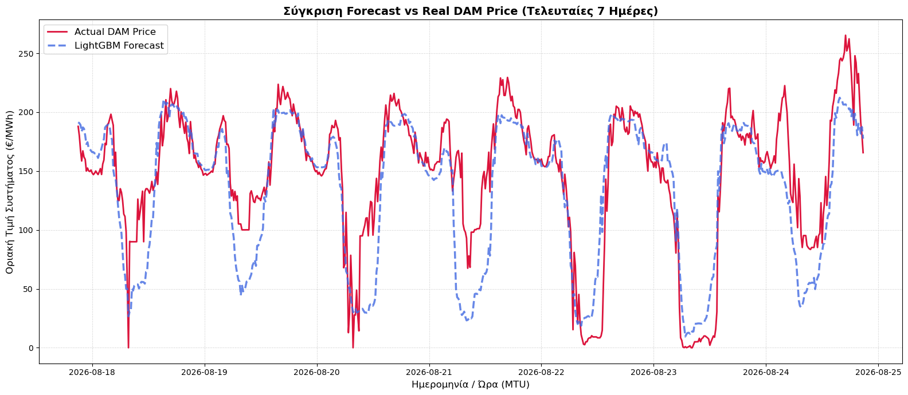

##  Model Performance & Backtesting Analysis

The model's robustness was tested using a dynamic rolling-window validation approach. We evaluated the LightGBM algorithm across various training window sizes (150, 120, 90, 60, and 45 days) to assess the trade-off between capturing recent market dynamics and maintaining long-term structural trends.

### Overall Out-of-Sample Metrics

### Overall Out-of-Sample Metrics

| Metric | Out-of-Sample Value |
| :--- | :--- |
| **Out-of-Sample MAE** | 20.07 €/MWh |
| **Out-of-Sample RMSE** | 32.11 €/MWh |

### Detailed Error Analysis by Price Bin (Dynamic Blend)

| Price Bin (€/MWh) | MAE (€/MWh) | Sample Count | Market Regime |
| :--- | :--- | :--- | :--- |
| **(-inf, 0.0]** | 8.40 | 3734 | Cannibalization / RES Over-generation |
| **(0.0, 35.0]** | 21.17 | 2281 | Low Demand Transition |
| **(35.0, 85.0]** | 25.04 | 2858 | Base Load |
| **(85.0, 115.0]** | 17.53 | 6383 | Target Model Sweet Spot |
| **(115.0, 150.0]** | 17.48 | 7229 | Target Model Sweet Spot |
| **(150.0, 200.0]** | 24.02 | 4635 | Evening Peak / Scarcity Start |
| **(200.0, inf]** | 38.54 | 2352 | Extreme Spikes / Market Panic |

### Visualizing the Forecast (90-Day Rolling Window)

